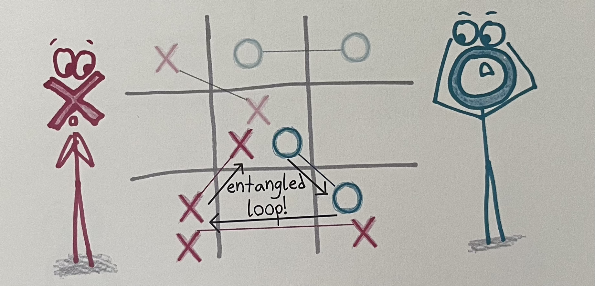
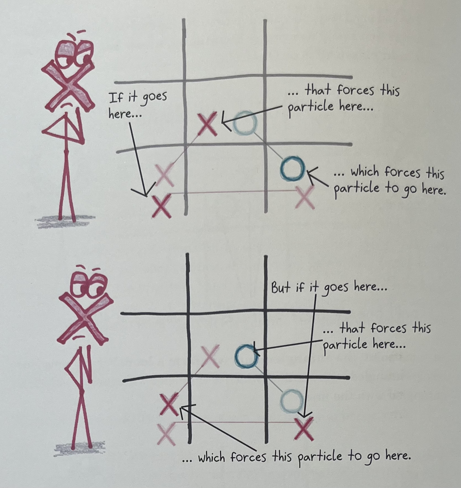

# Quantum Tic-Tac-Toe

A terminal-based implementation of [Quantum Tic-Tac-Toe](https://en.wikipedia.org/wiki/Quantum_tic-tac-toe) using Python and `curses` for direct buffer rendering. Zero external dependencies, stdlib only.

## How to Play

### Classical Rules (the foundation)

Standard Tic-Tac-Toe: two players (X and O) take turns placing marks on a 3×3 grid. First to get three in a row wins.

### Quantum Rules (the twist)

In Quantum TTT, moves exist in **superposition**. Instead of placing one mark in one cell, each turn you place a quantum mark in **two cells at once**. Your mark doesn't commit to either cell until it's forced to.

**On your turn:** choose two different empty-ish cells. Your mark (e.g. `X₃`) appears in both simultaneously, meaning it *could* end up in either one.

**Entanglement:** cells that share a quantum mark become entangled. As the game progresses, chains of entanglement build across the board.

### The Entanglement Loop

When a new quantum move creates a **cycle** in the entanglement graph, meaning a chain of shared quantum marks loops back on itself, a measurement is forced. The marks in the cycle must collapse into classical (definite) positions.



### Collapse

The player who **did not** cause the cycle chooses how it collapses. They pick which cell one of the entangled marks settles into, and the rest of the chain is forced to follow. Each mark resolves to whichever of its two cells is still available.



Once collapsed, those cells hold classical marks just like regular Tic-Tac-Toe. The board is then checked for a winner using the standard three-in-a-row rule.

## Running

```bash
uv run python -m quantum_ttt.main
```

## Running Tests

```bash
uv run pytest
```
